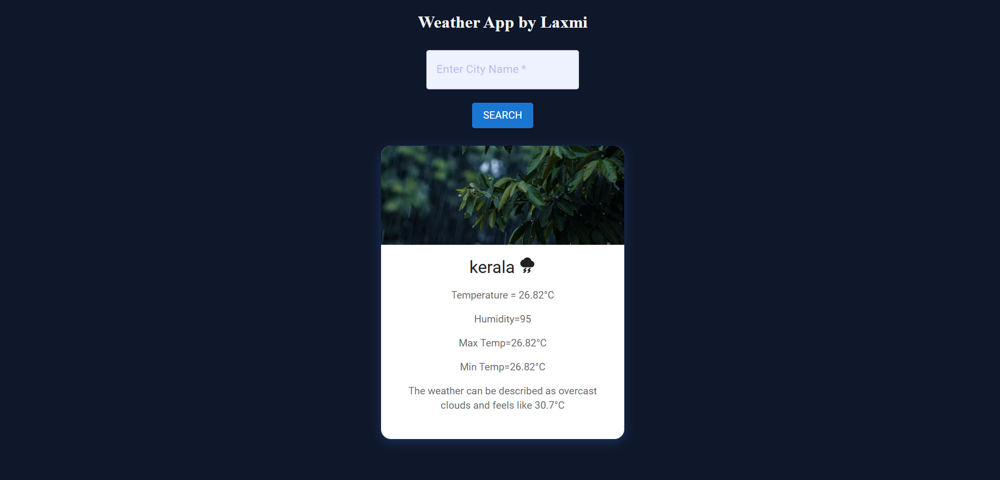
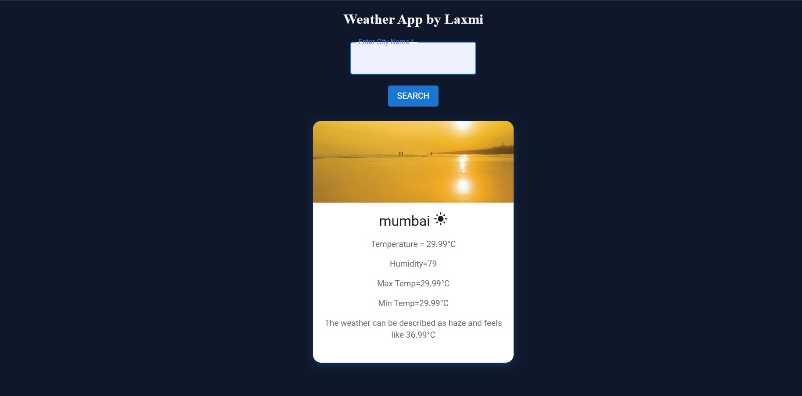
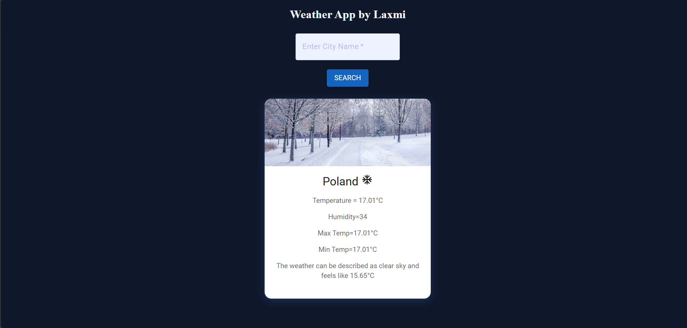

# Weather App 🌦️

A modern and responsive weather application built using React.js.  
This app allows users to search for any city and view real-time weather information including temperature, humidity, min/max temperature, and weather conditions.

## Features ✨

- Search weather by city name
- Real-time weather data
- Dynamic weather icons
- Responsive UI
- Animated weather card
- Different background images based on weather conditions
- Clean and modern design

## Tech Stack 🚀

- React.js
- Material UI
- CSS
- OpenWeather API

## Screenshots 📸





## Installation ⚙️

1. Clone the repository

```bash
git clone your-repository-link
```

2. Move into project folder

```bash
cd weather-app
```

3. Install dependencies

```bash
npm install
```

4. Start development server

```bash
npm run dev
```

## API Used 🌍

- OpenWeatherMap API

Get your free API key from:  
https://openweathermap.org/api

## Folder Structure 📁

```txt
src
 ┣ components
 ┃ ┣ SearchBox.jsx
 ┃ ┣ InfoBox.jsx
 ┃ ┗ WeatherApp.jsx
 ┣ App.jsx
 ┣ main.jsx
 ┗ App.css
```


## Author 👨‍💻

Made with ❤️ by Laxmi 
